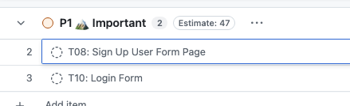
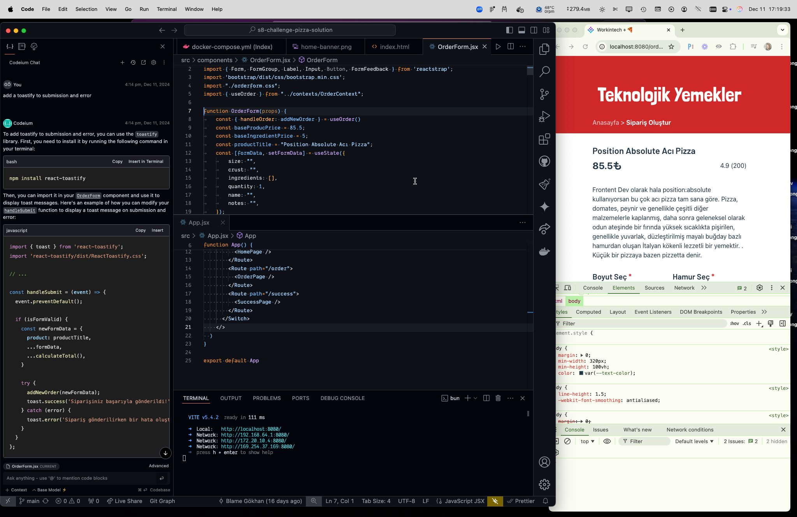

# eComm Party Tips 🎉

eComm Party Tips dökümantasyonuna hoş geldiniz! Burada 4 haftalık e-ticaret projesi simülasyonu boyunca, konuştuklarımızı ve paylaşılanları tutmak için ikinci bir beyin oluşturmaya çalışacağım. Gün içinde konuştuğumuz ama eksik kalan noktaları düzeltmek isterseniz çekinmeden PR atabilirsiniz.

Toplantı notlarında en yenisi en üstte olacak şekilde listelenecek.

Hepinize iyi eğlenceler 🎉

**Araçlar**

- [Etkinlik Takvimi](https://calendar.google.com/calendar/embed?src=c_98c8f84a6053ffa5ae9eb842f56dac4f9fc139c222ef308be5a3f5c2e2547585%40group.calendar.google.com&ctz=Europe%2FIstanbul)
- Hazırlık dökümanı: [Github'da Proje Oluşturma ve Sorunları Yönetme](https://scribehow.com/shared/Githubda_Proje_Olusturma_ve_Sorunlari_Yonetme__H5vwPO2rSkmruCE-b5NUJw) #docs #github
- Kanban [Project Plan](https://github.com/orgs/Workintech-Graduate-Projects/projects/12/views/2) ı #github
- Önerilen Youtube Playlisti: [Workintech Projesi Doping](https://youtube.com/playlist?list=PL-w1xOwMMQ1PTMXidBINRj9diBko1X86U&si=593jWnLYhvXqixK1)
- [Toplantı Zoom Linki](https://zoom.us/j/97526490985?pwd=0gffJUjtsB4SY4kbYbBmVqOCyY9EyN.1)


<!-- START doctoc generated TOC please keep comment here to allow auto update -->
<!-- DON'T EDIT THIS SECTION, INSTEAD RE-RUN doctoc TO UPDATE -->

- [W1D3: 2024-12-11](#w1d3-2024-12-11)
  - [😎 PM Meeting Notes: "Houston we have a problem: SignUp Login"](#-pm-meeting-notes-houston-we-have-a-problem-signup-login)
    - [Internet Sayfaları](#internet-sayfalar%C4%B1)
    - [Masaüstü Uygulamaları](#masa%C3%BCst%C3%BC-uygulamalar%C4%B1)
  - [🤓 Dev Meeting Notes "hızlı çalışmayı değil, verimsiz çalışmamayı düşünün"](#-dev-meeting-notes-h%C4%B1zl%C4%B1-%C3%A7al%C4%B1%C5%9Fmay%C4%B1-de%C4%9Fil-verimsiz-%C3%A7al%C4%B1%C5%9Fmamay%C4%B1-d%C3%BC%C5%9F%C3%BCn%C3%BCn)
    - [VS Code Eklentileri](#vs-code-eklentileri)
- [W1D2: 2024-12-10](#w1d2-2024-12-10)
  - [😎 PM Meeting Notes: "PM çok da yazılımdan uzak değilmiş"](#-pm-meeting-notes-pm-%C3%A7ok-da-yaz%C4%B1l%C4%B1mdan-uzak-de%C4%9Filmi%C5%9F)
  - [🤓 Dev Meeting Notes "Github'dan kaçarken gride tutulduk"](#-dev-meeting-notes-githubdan-ka%C3%A7arken-gride-tutulduk)
- [W1D1 2024-12-09](#w1d1-2024-12-09)
  - [Açılış 🚀🚀](#a%C3%A7%C4%B1l%C4%B1%C5%9F-)
    - [Norming](#norming)
      - [Takım İçi Geri Bildirim Almak ve Vermek](#tak%C4%B1m-%C4%B0%C3%A7i-geri-bildirim-almak-ve-vermek)
      - [Pair Programming #sofskill](#pair-programming-sofskill)
  - [😎 PM Meeting Notes: "Neden GitHub Projects kullanıyoruz? Jira yok mu?](#-pm-meeting-notes-neden-github-projects-kullan%C4%B1yoruz-jira-yok-mu)
  - [🤓 Dev Meeting Notes: "Tailwind ile başımmm dertteee, ne yapsam bilmiyorummm"](#-dev-meeting-notes-tailwind-ile-ba%C5%9F%C4%B1mmm-dertteee-ne-yapsam-bilmiyorummm)
- [Takım Listesi](#tak%C4%B1m-listesi)

<!-- END doctoc generated TOC please keep comment here to allow auto update -->

# W1D3: 2024-12-12

#read [JS olmadan accordeon](https://www.bram.us/2024/12/03/more-options-for-styling-details)](https://www.bram.us/2024/12/03/more-options-for-styling-details)

Derslere sığmayanlar: https://www.youtube.com/@dodokod
Umarım ilk günden paylaşmadığım için pişman olmam. Siz biliyorsunuz sanıyordum. Kurulumda takılanlar için: [Hata Gerçirmez Yazılımcı Adaylarına İpuçları - Tips for #FailProof Junior Devs](https://www.youtube.com/watch?v=byzfrZ3qLDY&list=PL-w1xOwMMQ1M1h8j7y_gctCYa5s_G1Ulp)

## 😎 PM Meeting Notes: "Otoparktayız"

- Küçük GitKraken ve PR acıları.
  Organizasyonal izinler eksikmiş. Verildi.

## 🤓 Dev Meeting Notes "GitHub'ım biçim biçim"

- [GitKraken ile conflict ve nasıl çözülür](https://www.gitkraken.com/learn/git/tutorials/how-to-resolve-merge-conflict-in-git). Baya drag-drop yapmışlar ben bunu kaçırmıştım.

# W1D3: 2024-12-11

İlk sunumlar yapıldı. Proje planında acil değişiklik yapıldı. "Yeni asistanınızla tanışın"

## 😎 PM Meeting Notes: "Houston we have a problem: SignUp Login"

AI sizin yasak aşkınız, kopya arkadaşınız değil, ekip üyeniz asistanınız. Siz PM o Asistan perspektifinden bakmalısınız.

### Internet Sayfaları

- [DeepL](https://www.deepl.com/en/translator) tecüme
- [Blackbox.ai](https://www.blackbox.ai) #ui
  - [SignUp Form Conversation](https://www.blackbox.ai/share/f85d7cd1-e7bb-4d7e-8bf9-ae300ccaa8d4)
- [v0](https://v0.dev) #ui
  - [Signup Form Conversation](https://v0.dev/chat/mHrzD0Kqzij?b=b_BrVkTlt5IQp)

**#bugbounty**

- Aday: Berk Karademir
  "useNavigate react router v6'yla beraber gelmiş ve useHistory yerine kullanılmış, bizden Task-1 de v5 kurmamız istendiği için projeyi patlatıyor ilgili kısımlar useHistory ile değiştirilebilir :)"
- Sonuç: Gidiş yolu doğru: "PM, AIa v5 kullanıyoruz demediğinden, asistanın ürettiği kod hatalı sayılmaz. PM hatalı, eksik iş tanımı vermiş"

### Masaüstü Uygulamaları

Webde çalışsalar da bilgisayarlarınıza indirerek kullanmanızı ben ve teknik istiyoruz.

- [GitKraken](https://staging-www.gitkraken.com/download)
  TODO:[0924-Docs](https://github.com/eCommerce-Party/0924-docs/tree/main/fun)’a ekleme yapıp PR atabilirsiniz. Takım listesi ekledim. Herkes altına kendi adını yazıp, isimlere GitHub profillerinizi linklesin.
- [Postman](https://www.postman.com/downloads/) projeniz için bir collection oluşturup, ilerledikçe dökümente edin.

Hızlı çalışmaya çalışmak verine, sizi yavaşlatan kısımları azaltın. Kendinizi izleyin ve israfı azaltın.
["Bu Koç Her Küçük Şeyi Yüzde 1 İyileştirdi ve İşte Olanlar"](https://jamesclear.com/marginal-gains) #read #goldmine makaleyi [deepl](https://www.deepl.com/en/translator#en/tr/https%3A%5C%2F%5C%2Fjamesclear.com%5C%2Fmarginal-gains) ile tercüme edebilirsiniz.

- Sonraki müşsteri sunumunda müşteri fonksiyonalite görmek istiyor.  iş planına eklendi.

## 🤓 Dev Meeting Notes "hızlı çalışmayı değil, verimsiz çalışmamayı düşünün"

### VS Code Eklentileri

- Asistan + Chat [Codeium](https://marketplace.visualstudio.com/items?itemName=Codeium.codeium)
  **⚠ AYNI ANDA İKİ FARKLI ASİSTAN AKTİFLEŞTİRMEYİN** Örn codeium + copilot vs
- Prettier

Verimli çalışmak için, pencereler arasında gezmeyecek şekilde masa üstünüzü düzenleyin. Az ekran değiştirin.


_PowerToys ile Masaüstünü Etkili Kullanmak_

*https://www.loom.com/share/928a416a4bb64b3299df316b660aa2f4*

(Kendimi çektim, belki meşhur olurum diye. Şakası bir yana program efsaneee, arayüz oldukça basit ve bir o kadar da işlevsellik barındırıyor.)
(Artık sabah uyanınca kim Vs-Code'u açaçak,tarayıcıyı açaçak onu yazacak bunu kapatacak... derdine son! _Tek tık ile sizin adınıza saniyeler içerisinde kayıtlı çalışma düzeninizi ekrana getiriyor._)

# W1D2: 2024-12-10

Isınma turları

## 😎 PM Meeting Notes: "PM çok da yazılımdan uzak değilmiş"

- [Agile Estimation nedir ve Story Points?](https://medium.com/@yasarny/0dan-100-e-kadar-fibonacci-agile-modelde-saatler-yeri̇ne-story-points-1c1eeda32932) #agile #read
- [A successful Git branching model](<- https://nvie.com/posts/a-successful-git-branching-model/>) #github
- Github’ı görselleştirmek için [GitKraken](https://www.gitkraken.com/) Uygulaması
- [HTML `<s>` Tag](https://www.w3schools.com/tags/tag_s.asp)
- State of Surveys

  - [State of HTML](https://survey.devographics.com/tr-TR/survey/state-of-html/2024/outline/1)
  - [State of CSS](https://2023.stateofcss.com/en-US/css-frameworks/)

## 🤓 Dev Meeting Notes "Github'dan kaçarken gride tutulduk"

- [Antropic Cloude AI Prompt Engineering Interactive Tutorial](https://github.com/anthropics/courses/tree/master/prompt_engineering_interactive_tutorial) #goldmine #tutorial #ai
- [Airbnb JavaScript Style Guide](https://airbnb.io/javascript/react/) #tip
- Tailwind config örnekleri
  - [Resmi Docs](https://tailwindcss.com/docs/adding-custom-styles) #goldmine maalesef
  - Varsayılan font ve .container ile [Tailwind Config örneği](https://veryfront.com/docs/tailwind-config) #tip
  - Tailwind Config [Örnek 2 ### Change the default styling başlığı](https://www.themes.dev/blog/typographic-defaults-in-tailwind-css/)
- Grid
  - [CSS ile Grid](https://www.youtube.com/watch?v=EiNiSFIPIQE&list=PL-w1xOwMMQ1PTMXidBINRj9diBko1X86U&index=11)
  - [Tailwind ile Grid](https://www.youtube.com/watch?v=b-hrxkgkG-s&list=PL-w1xOwMMQ1PTMXidBINRj9diBko1X86U&index=12)
  - [Google’da tailwind grid generator araması sonucu](https://www.tailwindgen.com/)
-
- VS Code Eklentileri #addon #vscode
  - [Teknik Borçlanma](https://www.stepsize.com/blog/best-vs-code-extensions-to-handle-todos) #read #tip
    - [Todo Tree](https://marketplace.visualstudio.com/items?itemName=Gruntfuggly.todo-tree)
    - [TODO Highlight](https://marketplace.visualstudio.com/items?itemName=jgclark.vscode-todo-highlight)
  - AI Coding
    - [Codeium](https://codeium.com/vscode_tutorial) #ai
  - [Responsive Viewer](https://chromewebstore.google.com/detail/responsive-viewer/inmopeiepgfljkpkidclfgbgbmfcennb?hl=en&pli=1) #extension

---

# W1D1 2024-12-09

```bash
console.error(`Hello real world! #ecomm`);
```

## Açılış 🚀🚀

**Araçlar**

- [Etkinlik Takvimi](https://calendar.google.com/calendar/embed?src=c_98c8f84a6053ffa5ae9eb842f56dac4f9fc139c222ef308be5a3f5c2e2547585%40group.calendar.google.com&ctz=Europe%2FIstanbul)
- Hazırlık dökümanı: [Github'da Proje Oluşturma ve Sorunları Yönetme](https://scribehow.com/shared/Githubda_Proje_Olusturma_ve_Sorunlari_Yonetme__H5vwPO2rSkmruCE-b5NUJw) #docs #github
- Kanban [Project Plan](https://github.com/orgs/Workintech-Graduate-Projects/projects/12/views/2) ı #github
- Önerilen Youtube Playlisti: [Workintech Projesi Doping](https://youtube.com/playlist?list=PL-w1xOwMMQ1PTMXidBINRj9diBko1X86U&si=593jWnLYhvXqixK1)
- [Toplantı Zoom Linki](https://zoom.us/j/97526490985?pwd=0gffJUjtsB4SY4kbYbBmVqOCyY9EyN.1)

### Norming


- Takım Kurulumu https://www.rebelscrum.site/post/forming-storming-norming-and-performing-for-agile-teams

- Agile Proje Akışı Yönetimi

  - Figma [Proje Akışı Yönetimi](https://www.figma.com/board/KyssFbNurYfdE8RyvgR9aE/Scrum-Overview?node-id=0-1&t=tnNswvgnvugFQy5k-1) #figma
  - [Google Eğitimler](https://grow.google/intl/tr/courses-and-tools/?category=career) #goldmine #training
    [Google Project Management: Professional Certificate](https://www.coursera.org/google-certificates/project-management-certificate) #training #pm

    Courseradan Ücretsiz ders yani [financial aid nasıl alınıd](https://www.youtube.com/watch?app=desktop&v=FR6anE_pfMU&t=0s) #youtube #pm

  - [Agile Project Management Certificate](https://www.youtube.com/playlist?list=PLTZYG7bZ1u6puLWxUtqAjZkIB4dB_JFzk) by Google #youtube #playlist #pm

#### Takım İçi Geri Bildirim Almak ve Vermek

**6 Şapkalı Düşünme Tekniği Nedir? [Ekşi Sözlük](https://eksisozluk.com/entry/7312524) #sofskill**

- beyninin herseyi bir anda düsünmesi ve bu sebeple en basit konularda bile çözümün geç olusmasi sebebi ile gelistirilmis düsünme teknigi. ayni adli kitabin arka kapaginda yer alan ve yöntemi tanitmak için kullanilan cümle de hayli ilgi çekici: "bu yöntemle düsüncelerinizi bir orkestra sefi gibi yönetebilecek, sonu gelmeyen tartismalarda kaybolmak yerine, yaratici ve yapici sonuçlar elde edebileceksiniz."
- [iienstitu](https://www.iienstitu.com/blog/alti-sapkali-dusunme-teknigi-nedir)

#### Pair Programming #sofskill

İlk haftalık ekipler belirlendi.

- [Birlikte Kodlama Sanatı: Pair Programming](https://dumanburak.medium.com/birlikte-kodlama-sanat%C4%B1-pair-programming-1373f82ca0d4#:~:text=Pair%20programming%2C%20genel%20olarak%20iki,kaynak%20israf%C4%B1%20ve%20yorucu%20gelebilir.) #read

Aşağıdakiler opsiyonel

- [On Pair Programming](https://martinfowler.com/articles/on-pair-programming.html) #read en çok tavsiye edilen yazı. #goldmine
- [Mastering Pair Programming — Best Practices](https://medium.com/@shubhadeepchat/mastering-pair-programming-best-practices-5736c7bc17ca) #read
- [Anthony Sistilli](https://www.youtube.com/shorts/0wKYzH3Y0Rk) #youtube shorts
- [How to do Effective Pair Programming](https://www.youtube.com/watch?v=hOtC_LhYHN8) #youtube

## 😎 PM Meeting Notes: "Neden GitHub Projects kullanıyoruz? Jira yok mu?

Takımlara belirlendi #rafiki. İş kabul standartları belirlendi.

- https://huemint.com/website-2/ #ai renk paleti
- Placeholders
- https://placehold.co/
- https://logoipsum.com/

## 🤓 Dev Meeting Notes: "Tailwind ile başımmm dertteee, ne yapsam bilmiyorummm"

- Tailwind [Design System Eklemek](https://tailwindcss.com/docs/plugins#adding-base-styles)
- Tailwind Container
  - [Docs](https://tailwindcss.com/docs/container)
  - [Demo](https://tw-elements.com/learn/te-foundations/tailwind-css/containers/)
- Carousel Slider
  - [How to create carousel slider in Tailwind css and React js ?](https://www.youtube.com/watch?app=desktop&v=GguJODC2cvI&t=565s) #youtube #tutorial

# Takım Listesi

TODO: Herkes, repoda kendi adıyla bir branch açıp, buranın altına kendi adını, proje planını ve Reposunu eklesin ve main'e PR atsın. Beni de reviewer eklesin.

- [Gökhan Özdemir](https://github.com/gokhanozdemir) Proje [Planı](https://github.com/orgs/Workintech-Graduate-Projects/projects/12/views/2) ve [Repo](https://github.com/gokhanozdemir/mesela-ecommerce)
- [Gökcan Parlaktaş](https://github.com/gokcanparlaktas) Proje [Planı](https://github.com/users/gokcanparlaktas/projects/1) ve [Repo](https://github.com/gokcanparlaktas/PixelWear)
- [Enes Uzunoğlu](https://github.com/enes-uzunoglu) Proje [Planı](https://github.com/users/enes-uzunoglu/projects/2/views/1) ve [Repo](https://github.com/enes-uzunoglu/alem_ticaret)
- [Gülşah Karakılıç](https://github.com/Gulsahkrklc) Proje [Planı](https://github.com/users/Gulsahkrklc/projects/5) ve [Repo](https://github.com/Gulsahkrklc/e-comm)
- [Furkan Ozan Yüce](https://github.com/furkanozanyuce) Proje [Planı](https://github.com/users/furkanozanyuce/projects/1) ve [Repo](https://github.com/furkanozanyuce/my-ecommerce)
- [[Berk Karademir](https://github.com/berk-karademir)] - [[Proje Planı](https://github.com/users/berk-karademir/projects/3)] - ([Proje Reposu](https://github.com/berk-karademir/BekoStore))
- [Havva Asal](https://github.com/HavvaAsal) Proje [Planı](https://github.com/users/HavvaAsal/projects/1) ve [Repo](https://github.com/HavvaAsal/shop-sphere)
